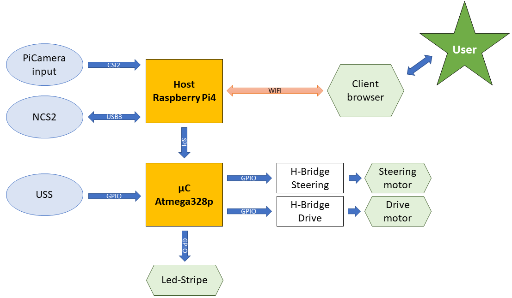
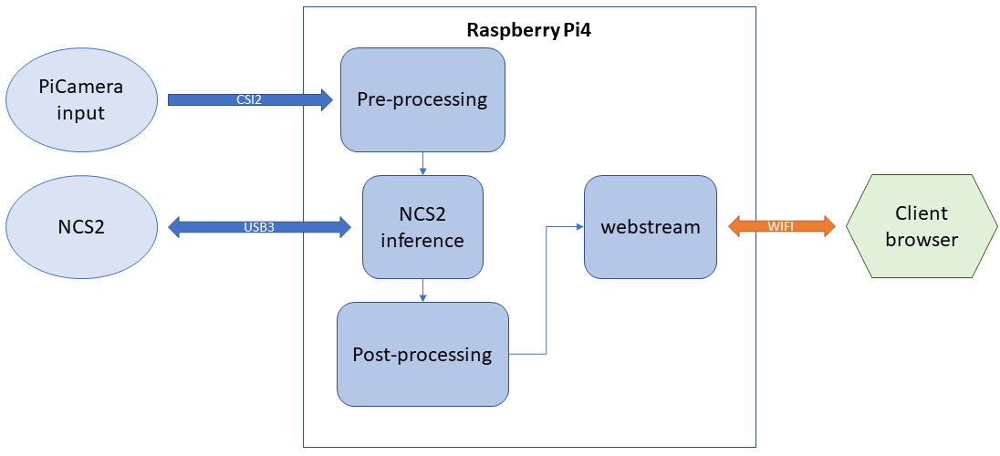
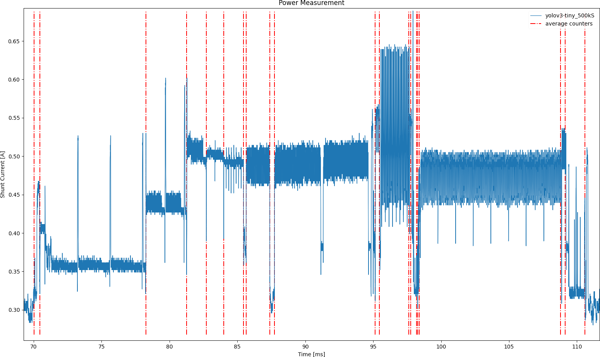

<!--more-->

## Main Components

* Raspberry Pi 4 - for the general interface between user and Demonstrator
* Intel Neural Compute Stick 2 with Openvino - for inference on the edge
* Yolov3-tiny - Neural Network for object detection in images

## System Interaction

The RPi4 sends images from a camera to the NCS2, which returns the probabilites and bounding boxes to be displayed for the user in a browser window.

  

The Demonstrator can be remotely controlled via the keyboard in the browser.
The neural network Yolov3-tiny is responsible for object detection and runs at a frame rate of around 12 fps, while utilizing the Openvino API for inference.

  

## Power Profiling

A concept to measure the power consumption of the NCS2 during the execution of any neural network was conceived during the making of the Demonstator.
Power Profiles, such as in the image below, tell how much each layer of the neural network consumes, with the possible prospect of targeted layer optimization for energy consumption.

  

